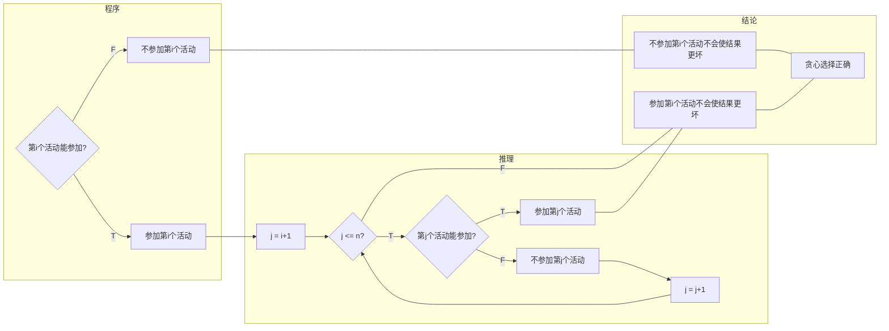
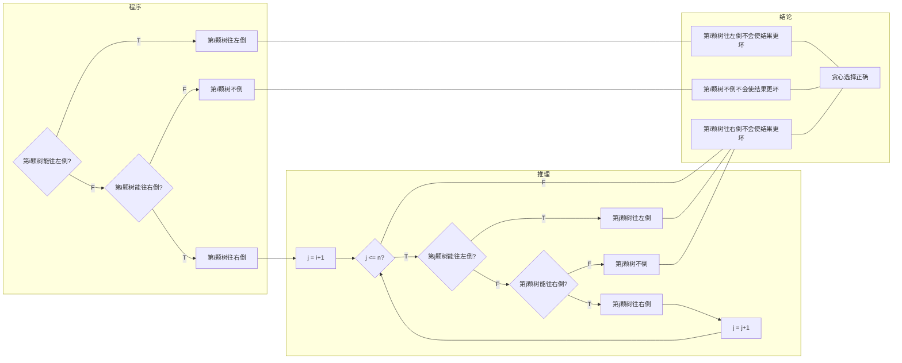
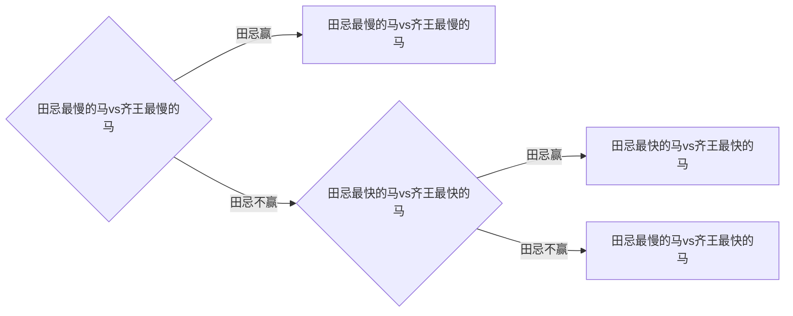
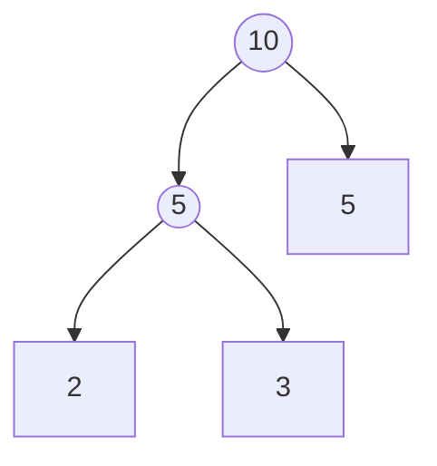

# 2021年秋计算概论（B）作业合集

Fall 2021 Introduction to Computing (B) Assignment Collection


Updated 2221 GMT+8 June 5, 2022


2021/12/24

北大 元培学院 吉祥瑞

# Assignment #1

## 4A. Watermelon, brute force/math

http://codeforces.com/problemset/problem/4/A

解题思路：假设能，则他们分得的质量分别为$2n$和$2m$（$n,m\in \mathbb{N}_+$），故总质量需为$2(n+m)=2k$（$k\geqslant2,k\in \mathbb{N}_+$）。

```python
w = int(input())
if (w >= 4) and (w % 2 == 0):
    print('YES')
else:
    print('NO')

```

## 71A. Way Too Long Words, strings

http://codeforces.com/problemset/problem/71/A

```python
n = int(input())
for i in range(n):
    word = input()
    length = len(word)
    if length>10:
        print(word[0]+str(length-2)+word[-1])
    else:
        print(word)

```

## 2750. 鸡兔同笼, math

http://cs101.openjudge.cn/practice/2750

解题思路：设有$x$只鸡，$y$只兔子，则$2x+4y=a,x\in\mathbb{N},y\in\mathbb{N}$，总数$z=x+y$。由高中学过的线性规划知识，$x=\frac{a}{2}$时$z_{max}=\frac{a}{2}$，若$a$为4的倍数，则$x=0$时$z_{min}=\frac{a}{4}$；若$a$不是4的倍数但是2的倍数，则$x=1$时$z_{min}=\frac{a+2}{4}$。

```python
a = int(input())
if a % 4 == 0:
    print(int(a/4), int(a/2))
elif a % 2 == 0:
    print(int((a+2)/4), int(a/2))
else:
    print(0, 0)

```

## 2733. 判断闰年, math

http://cs101.openjudge.cn/practice/2733

```python
a = int(input())
if (a % 3200 == 0) or ((a % 100 == 0) and (a % 400 != 0)):
    print('N')
elif a % 4 == 0:
    print('Y')
else:
    print('N')

```

## （补充）21532: 数学密码, brute force/math, cs10120 Final Exam

http://cs101.openjudge.cn/practice/21532

解题思路：设$n=a+b+c$，$a,b,c$的最大公因数是$k$，则$n=k(\frac{a}{k}+\frac{b}{k}+\frac{c}{k})$，其中$\frac{a}{k},\frac{b}{k},\frac{c}{k}$是互不相同的正整数。因此$k$也是$n$的公因数，且$\frac{a}{k}+\frac{b}{k}+\frac{c}{k}\geqslant6$.

```python
n = int(input())
for i in range(n//6, 0, -1):
    if n % i == 0:
        print(i)
        break

```

# Assignment #2

## 1A. Theatre Square, math, 1000

http://codeforces.com/problemset/problem/1/A

```python
import math
n, m, a = map(int, input().split())
print(math.ceil(n/a)*math.ceil(m/a))

```

## 231A. Team, bruteforce/greedy, 800

http://codeforces.com/problemset/problem/231/A

```python
n = int(input())
k = 0
for i in range(n):
    a, b, c = map(int, input().split())
    if a+b+c > 1:
        k += 1
print(k)

```

## 158A. Next Round, special problem/implementation, 800

http://codeforces.com/problemset/problem/158/A

解题思路：以下代码中的`i`有双重作用，一方面是列表的索引，另一方面统计晋级人数。While循环判断分数`a[i]`能否晋级，如果能，则`i`加1。最终的`i`会比最后一位晋级者的索引多1，但由于索引从0开始，人数也比索引多1，因此最终的`i`就是晋级人数。

```python
n, k = map(int, input().split())
a = [int(x) for x in input().split()]
i = 0
while (i < n) and (a[i] > 0) and ((i < k) or (a[i] == a[i-1])):
    i += 1
print(i)

```

注：`a = [int(x) for x in input().split()]`还可换成`a = list(map(int, input().split()))`；条件`(i < k) or (a[i] == a[i-1])`可简化为`a[i] >= a[k-1]`。

## 50A. Domino piling, greedy/math, 800

http://codeforces.com/problemset/problem/50/A

解题思路：若$M$和$N$中存在偶数，则最大数量为$\frac{MN}{2}$；若$M$和$N$均为奇数，将会有1个小方块覆盖不到，最大数量为$\frac{MN-1}{2}$。可统一写成$\lfloor\frac{MN}{2}\rfloor$。

```python
M, N = map(int, input().split())
print(int(M*N/2))

```

## 03087. 邮箱验证, string

http://cs101.openjudge.cn/practice/03087/

```python
while True:
    try:
        s = input()
        if (s[0] in '@.') or (s[-1] in '@.') or ('.@' in s) or ('@.' in s):
            print('NO')
        else:
            at = False
            dot = False
            for i in s:
                if i == '@':
                    if at:
                        at = False
                        break
                    else:
                        at = True
                elif at and (i == '.'):
                    dot = True
            if dot and at:
                print('YES')
            else:
                print('NO')
    except EOFError:
        break

```

注：使用字符串内建函数能使代码简化。用find()而不用index()，因为index()没找到时会报错。

```python
while True:
    try:
        s = input()
        if (s[0] in '@.') or (s[-1] in '@.') or ('.@' in s) or ('@.' in s) or (s.count('@') != 1) or (s.count('.', s.find('@'), -1) == 0):
            print('NO')
        else:
            print('YES')
    except EOFError:
        break

```

补充：对于列表，只有index()而没有find()。

## 1221A. 2048 Game, brute force/greedy/math, 1000

http://codeforces.com/problemset/problem/1221/A

解题思路：

引理：设$k$是给定非负整数，一集合中的元素均为$2^m$（$m\in\mathbb{N},m\leqslant k$）的形式，若该集合中所有元素之和不小于$2^{k+1}$，则该集合可划分为两部分，使每部分中所有元素之和不小于$2^k$。

证明：用数学归纳法。当集合中有2个元素时，只可能都是$2^k$，显然成立。假设集合有$n$个元素时成立。当有$n+1$个元素时，若其中有$2^k$，显然成立；若其中没有$2^k$，假设所有元素各不相同，则它们的和一定小于$2^{k+1}$，矛盾，因此，一定存在两个元素相同，把它们加起来合并，仍然是$2^m$（$m\in\mathbb{N},m\leqslant k$）的形式，现在只剩下了$n$个元素，由归纳假设得证。$\Box$

命题：能赢“$2^n$  Game”（$n\in\mathbb{N}$）$\Leftrightarrow$集合中所有不大于$2^n$的元素之和不小于$2^n$。

证明：“$\Rightarrow$”方向显然成立。

“$\Leftarrow$”方向用数学归纳法。$n=0$时，显然成立。假设$n=k$（$k\in\mathbb{N}$）时成立。当$n=k+1$时，对于包含元素$2^{k+1}$的集合，“$\Leftarrow$”方向成立；对于不包含元素$2^{k+1}$的集合，由引理，可将其划分为两部分，使每部分中所有不大于$2^k$的元素之和不小于$2^k$，由归纳假设，每部分都能赢“$2^k$  Game”，因此能赢“$2^{k+1}$  Game”。$\Box$

```python
q = int(input())
for i in range(q):
    n = int(input())
    s = filter(lambda x: x <= 2048, map(int, input().split()))
    if sum(s) >= 2048:
        print('YES')
    else:
        print('NO')

```

## 270A. Fancy Fence, geometry/implementation/math, 1100

https://codeforces.com/problemset/problem/270/A

解题思路：多边形外角和为360°，故$\frac{360}{180-a}$需为整数。

```python
t = int(input())
for i in range(t):
    a = int(input())
    if 360%(180-a) == 0:
        print('YES')
    else:
        print('NO')

```

# Assignment #4

## 112A. Petya and Strings, implementation/strings, 800

http://codeforces.com/problemset/problem/112/A

解题思路：Python会通过依次比较字符的Unicode 编码来比较字符串的大小。题目要求不区分大小写，因此先把字符串统一转成小写。
参考：https://docs.python.org/3/reference/expressions.html#comparisons，https://docs.python.org/3/library/stdtypes.html，https://docs.python.org/3/library/functions.html

```python
a = input().lower()
b = input().lower()
if a < b:
    print(-1)
elif a > b:
    print(1)
else:
    print(0)

```

注：Python 3中，bytes类型用ASCII码，str类型用Unicode码。一般Unicode码为两字节，ASCII码前面补一个字节的0就是对应的Unicode码。ord()能把字符变成Unicode码，chr()函数反之。

## 118A. String Task, implementation/strings, 1000

http://codeforces.com/problemset/problem/118/A

```python
a = input().lower()
for i in a:
    if i not in 'aoyeui':
        print('.'+i, end='')

```

注：`print`函数默认`end='\n'`，会换行，因此改成`end=''`。

## 263A. Beautiful Matrix, implementation, 800

http://codeforces.com/problemset/problem/263/A

解题思路：交换行或列相当于把1纵向或横向移动了一步，最小步数是1的位置$(i,j)$到中心$(2,2)$的横向与纵向距离之和。

```python
for i in range(5):
    r = [int(x) for x in input().split()]
    for j in range(5):
        if r[j] == 1:
            print(abs(i-2)+abs(j-2))

```

## 282A. Bit++, implementation, 800

http://codeforces.com/problemset/problem/282/A

```python
n = int(input())
x = 0
for _ in range(n):
    if '+' in input():
        x += 1
    else:
        x -= 1
print(x)

```

## 02808.校门外的树, implementation

http://cs101.openjudge.cn/practice/02808/

方法一：

```python
L, M = map(int, input().split())
t = [True]*(L+1)
for _ in range(M):
    a, b = map(int, input().split())
    for i in range(a, b+1):
        t[i] = False
print(t.count(True))

```

注：树的坐标和列表的索引均是从0开始的。

方法二：

```python
L, M = map(int, input().split())
t = set(range(L+1))
for _ in range(M):
    a, b = map(int, input().split())
    for i in range(a, b+1):
        t.discard(i)
print(len(t))

```

注：不用`t.remove(i)`，因为当`i`不属于`t`时会报错。还可把第5-6行改为`t = t-set(range(a, b+1))`。

方法三：

```python
L, M = map(int, input().split())
t = set()
for _ in range(M):
    a, b = map(int, input().split())
    t = t | set(range(a, b+1))
print(L+1-len(t))

```

注：还可把第5行改为`t = t.union(set(range(a, b+1)))`。

补充：集合知识参见https://www.runoob.com/python3/python3-set.html。

## 25A. IQ test, brute force, 1300

http://codeforces.com/problemset/problem/25/A

```python
n = int(input())
a = [int(x) % 2 for x in input().split()]
if sum(a) == 1:
    print(a.index(1)+1)
else:
    print(a.index(0)+1)

```

## 1374B. "Multiply by 2, divide by 6", math, 900

http://codeforces.com/problemset/problem/1374/B

解题思路：先一直将$n$除以6，直至不能除尽。再一直将$n$乘以2后除以6，即将$n$除以3，直至不能除尽。若此时$n$不是1，则说明无法实现。

```python
t = int(input())
for _ in range(t):
    n = int(input())
    s = 0
    while n % 6 == 0:
        n = int(n/6)
        s += 1
    while n % 3 == 0:
        n = int(n/3)
        s += 2
    if n == 1:
        print(s)
    else:
        print(-1)

```

# Assignment #5

## 339A. Helpful Maths, greedy/implementation/sortings/strings, 800

http://codeforces.com/problemset/problem/339/A

```python
s = list(map(int, input().split('+')))
s.sort()
print('+'.join(str(x) for x in s))

```

注：（1）第3行也可写成`print('+'.join(map(str, s)))`。

（2）sort()和sorted()也能排序字符串，sorted()返回一个列表而sort()没有返回值。上述代码可简化为：

```python
print('+'.join(sorted(input().split('+'))))

```

补充：sort()和sorted()使用的排序算法是Timsort，时间和空间复杂度如下表。
参考：https://en.wikipedia.org/wiki/Timsort

| Worst-case performance | Best-case performance | Average performance | Worst-case space complexity |
| ---------------------- | --------------------- | ------------------- | --------------------------- |
| $O(n\ln n)$            | $O(n)$                | $O(n\ln n)$         | $O(n)$                      |

## 281A. Word Capitalization,implementation/strings, 800

http://codeforces.com/problemset/problem/281/A

方法一：

```python
s = input()
print(s[0].upper()+s[1:])

```

方法二：

```python
s = input()
print(s.replace(s[0], s[0].upper(), 1))

```

## 266A. Stones on the Table, implementation, 800

http://codeforces.com/problemset/problem/266/A

 ```python
n = int(input())
s = input()
r = 0
for i in range(n-1):
    if s[i] == s[i+1]:
        r += 1
print(r)

 ```

## 96A. Football, implementation/strings, 900

http://codeforces.com/problemset/problem/96/A

 ```python
s = input()
print(['NO', 'YES'][('1'*7 in s) or ('0'*7 in s)])

 ```

注：代码第2行利用列表实现了if语句的功能，如果后一个方括号内判断结果为False，也就是0，就会输出前一个方括号所表示的列表的第0位元素，即'NO'，反之输出'YES'。

## 615A. Bulbs, implementation, 800 

http://codeforces.com/contest/615/problem/A

 ```python
n, m = map(int, input().split())
b = [False]*m
for _ in range(n):
    a = input().split()
    for j in a[1:]:
        b[int(j)-1] = True
print(['NO', 'YES'][b == [True]*m])

 ```

注：也可利用集合：

```python
n, m = map(int, input().split())
b = set()
for _ in range(n):
    b.update(input().split()[1:])
print(['NO', 'YES'][len(b) == m])

```

## 19944. 这一天星期几v0.3, math, cs10119 Final Exam

http://cs101.openjudge.cn/practice/19944/

```python
n = int(input())
for _ in range(n):
    a = input()
    c = int(a[0:2])
    y = int(a[2:4])
    m = int(a[4:6])
    if m in [1, 2]:
        m += 12
        if y>0:
            y -= 1
        else:
            y = 99
            c -= 1
    d = int(a[6:8])
    w = (y+y//4+c//4-2*c+(26*(m+1))//10+d-1) % 7
    weekday = ['Sunday', 'Monday', 'Tuesday', 'Wednesday', 'Thursday', 'Friday', 'Saturday']
    print(weekday[w])

```

易错点：某年的1、2月要看作上一年的13、14月来计算。若年份后两位数大于0，则直接减1；若年份后两位为“00”，则需变成“99”，并且把年份前两位数减1。

注：（1）Python没有switch或case语句，以上用列表实现了同样的效果。以下利用字典实现，这种方法更有一般性。

```python
def f0():
    print('Sunday')

def f1():
    print('Monday')

def f2():
    print('Tuesday')

def f3():
    print('Wednesday')

def f4():
    print('Thursday')

def f5():
    print('Friday')

def f6():
    print('Saturday')

#这里略去了上一方法的第1-15行未写
    weekday = {
        0: f0,
        1: f1,
        2: f2,
        3: f3,
        4: f4,
        5: f5,
        6: f6
    }
    f = weekday[w]
    f()

```

（2）其实可直接用Python的calendar库获取星期。

## 01017. 装箱问题, greedy, 

http://cs101.openjudge.cn/practice/01017/

解题思路：贪心策略是优先装大的产品。每个箱子里只能放一个6×6、5×5或4×4产品，能放4个3×3产品。放了5×5或4×4产品后的空隙中分别能放11个1×1产品或5个2×2产品。若还余下1、2或3个3×3产品，则剩余的空隙分别能放5、3或1个2×2产品和7、6或5个1×1产品，这可分别用$7-2x$和$8-x$统一表达，其中$x$是余下的3×3产品数量。若2×2产品不足以填完上述位置，则剩余的每个位置可变成4个1×1产品的位置；若上述位置不够填完2×2产品，则需增加箱子。没填满2×2产品的箱子的空隙可放1×1产品。若1×1产品在填完上述位置后仍有剩余，则还需增加箱子。

```python
import math
while True:
    a = [int(x) for x in input().split()]
    if a == [0, 0, 0, 0, 0, 0]:
        break
    s = math.ceil(a[2]/4)+a[3]+a[4]+a[5]
    box1 = a[4]*11
    box2 = a[3]*5
    if a[2] % 4 > 0:
        box1 += 8-a[2] % 4
        box2 += 7-2*(a[2] % 4)
    if box2 < a[1]:
        s += math.ceil((a[1]-box2)/9)
        if (a[1]-box2) % 9 > 0:
            box1 += (9-(a[1]-box2) % 9)*4
    else:
        box1 += (box2-a[1])*4
    if box1 < a[0]:
        s += math.ceil((a[0]-box1)/36)
    print(s)

```

注：（1）Python没有until循环，可结合`while True`和`break`来实现。

（2）可以用列表实现分类讨论：

```python
import math
rest1 = [0, 7, 6, 5]
rest2 = [0, 5, 3, 1]
while True:
    a = [int(x) for x in input().split()]
    if a == [0, 0, 0, 0, 0, 0]:
        break
    s = math.ceil(a[2]/4)+a[3]+a[4]+a[5]
    box1 = a[4]*11+rest1[a[2] % 4]
    box2 = a[3]*5+rest2[a[2] % 4]
#这里略去了上一方法的第12-21行未写
```

## 230B. T-primes, binary search, implementation, math, number theory, 1300

http://codeforces.com/problemset/problem/230/B

解题思路：有且只有质数的平方是T-primes。使用Euler筛法找质数，时间复杂度为$O(n)$。筛的过程中要保证两点：①合数一定被筛掉了；②每个数都没有被重复地筛掉。不管i是否是质数，都会执行到第9行处。这时，会有两种情况：①i是质数。筛出的数都是ans[j]*i（ans[j]≤i）的形式，不会与之前的重复。②i是合数。i可以表示成$p_1…p_n (p_1\leqslant⋯\leqslant p_n,n\geqslant 2)$，当i的最小质因数$p_1$等于ans[j]时终止。每个合数只会被它的最小质因数筛去，从而不重复筛选。

易错点：输入的$x_i$可能为1。

```python
n = int(input())
x = list(map(int, input().split()))
m = int(max(x)**0.5)
valid = [True]*(m-1)
ans = []
for i in range(2, m+1):
    if valid[i-2]:
        ans.append(i)
    for j in range(len(ans)):
        if i*ans[j] > m:
            break
        valid[i*ans[j]-2] = False
        if i % ans[j] == 0:
            break
for i in x:
    print(['NO', 'YES'][(i>1) and ((i**0.5) % 1 == 0) and valid[int(i**0.5)-2]])

```

以上代码用PyPy 3-64能过，但用Python 3超时。

进行了四处优化，最终Python 3 1840 ms能过。一是把`for j in range(len(ans)):`改成`for j in ans`，之后的`ans[j]`改成`j`；二是让valid的索引与数字直接对应，免去了许多数字减2的计算；三是将valid[1]设为False，免去了许多对i>1的判断；四是使用`for i in map(int, input().split()):`，而`m`一律设为1000000。经试验，上述每处优化均能减少测试数据的最长运行时间。

```python
n = int(input())
m = 1000000
valid = [True]*(m+1)
valid[1] = False
ans = []
for i in range(2, m+1):
    if valid[i]:
        ans.append(i)
    for j in ans:
        if i*j > m:
            break
        valid[i*j] = False
        if i % j == 0:
            break
for i in map(int, input().split()):
    print(['NO', 'YES'][((i**0.5) % 1 == 0) and valid[int(i**0.5)]])

```

意外的是，把valid改成字典后反而又会超时（并且占用内存大），或许是因为最初创建字典比较费时。（ans不能改成集合，因为需要保证从小到大的顺序，使每个合数只会被它的最小质因数筛去）

```python
n = int(input())
m = 1000000
valid = {}
valid = valid.fromkeys(range(2, m+1), True)
valid[1] = False
ans = []
for i in range(2, m+1):
    if valid[i]:
        ans.append(i)
    for j in ans:
        if i*j > m:
            break
        valid[i*j] = False
        if i % j == 0:
            break
for i in map(int, input().split()):
    print(['NO', 'YES'][((i**0.5) % 1 == 0) and valid[int(i**0.5)]])

```

使用Eratosthenes筛法，时间复杂度为$O(n\ln\ln n)$，Python 3 1090 ms能过，竟然更快。

```python
input()
valid = [True]*(1000001)
valid[1] = False
for i in range(2, 1001):
    if valid[i]:
        for j in range(i*i, 1000001, i):
            valid[j] = False
for i in map(int, input().split()):
    print(['NO', 'YES'][((i**0.5) % 1 == 0) and valid[int(i**0.5)]])

```

# Assignment #6

## 236A. Boy or Girl, brute force/implementation/strings, 800

https://codeforces.com/problemset/problem/236/A

解题思路：用集合满足不重复的需求。

 ```python
print(['CHAT WITH HER!', 'IGNORE HIM!'][len(set(input())) % 2 == 1])

 ```

## 69A. Young Physicist, implementation/math, 1000

https://codeforces.com/problemset/problem/69/A

 ```python
x = y = z = 0
for _ in range(int(input())):
    a, b, c = map(int, input().split())
    x += a
    y += b
    z += c
print(['NO', 'YES'][x == y == z == 0])

 ```

注：Python赋值和条件语句可以连着写。

## 122A. Lucky Division, brute force/number theory, 1000,

https://codeforces.com/problemset/problem/122/A

方法一：

 ```python
n = int(input())
for i in range(1, n+1):
    s = str(i)
    if (s.count('4')+s.count('7') == len(s)) and (n % i == 0):
        print('YES')
        exit(0)
print('NO')

 ```

方法二：

```python
n = int(input())
for i in range(1, n+1):
    s = set(list(str(i)))
    if (s in [{'4'}, {'7'}, {'4', '7'}]) and (n % i == 0):
        print('YES')
        exit(0)
print('NO')

```

## 19949. 提取实体v0.3, cs10119 Final Exam, string,

http://cs101.openjudge.cn/practice/19949/

 ```python
s = 0
for _ in range(int(input())):
    s += input().replace('### ###','').count('###')//2
print(s)

 ```

易错点：输出的是整篇文档的实体数而非每行的实体数。

## 1000B. Light It Up, greedy, 1500

https://codeforces.com/problemset/problem/1000/B

解题思路：为方便处理，在a的前后分别补上0和M，若n是偶数，则在a的后面再补上一个M，并令n加1。这样，区间[0,M]就能拆成(n+1)/2段，每段都先是“开”状态、再是“关”状态（最后一段的“关”状态时长可能为0）。令i=n,n-2,...,1，对于第(i+1)/2段，若存在一种状态的时长大于1，则有机会在这段中插入一个元素。为使收益最大，这个元素要么是a[i]+1，要么是a[i]-1。如下图，插入后与插入前的“开”状态时长相差了M-2ton-a[i]-1，让它最大即可。


```python
n, M = map(int, input().split())
a = [0]
a.extend([int(x) for x in input().split()])
if n % 2 == 0:
    a.append(M)
    n += 1
a.append(M)
ton = maxDelta = 0
for i in range(n, 0, -2):
    if (a[i+1]-a[i] > 1) or (a[i]-a[i-1] > 1):
        Delta = M-2*ton-a[i]-1
        if Delta > maxDelta:
            maxDelta = Delta
    ton += a[i]-a[i-1]
print(maxDelta+ton)

```

另一种版本的程序（方法相同）：

```python
n, M = map(int, input().split())
a = [int(x) for x in input().split()]
if n % 2 == 0:
    a.append(M)
    n += 1
b = [0]*(n+1)
b[0] = a[0]
for i in range(1, n):
    b[i] = a[i]-a[i-1]
b[n] = M-a[-1]
ton = maxDelta = 0
for i in range(n-1, -1, -2):
    if (b[i+1] > 1) or (b[i] > 1):
        maxDelta = max(M-2*ton-a[i]-1, maxDelta)
    ton += b[i]
print(maxDelta+ton)

```

# Assignment #7

## 723A. The New Year: Meeting Friends, implementation/math/sorting, 800

https://codeforces.com/problemset/problem/723/A

解题思路：设他们的坐标从小到大为$x_{(1)},x_{(2)},x_{(3)}$，则在$x_{(2)}$处碰面时总距离取到最小值$x_{(3)}-x_{(1)}$。

 ```python
x = [int(a) for a in input().split()]
print(max(x)-min(x))

 ```

## 705A. Hulk, implementation, 800

https://codeforces.com/problemset/problem/705/A

 ```python
n = int(input())
if n % 2 == 1:
    print('I hate that I love that '*(n//2)+'I hate it')
else:
    print('I hate that I love that '*(n//2-1)+'I hate that I love it')

 ```

## 200B. Drinks, implementation/math, 800

https://codeforces.com/problemset/problem/200/B

 ```python
n = int(input())
print(sum(map(int, input().split()))/n)

 ```

## 492B. Vanya and Lanterns, binary search/implementation/math/sortings, 1200

https://codeforces.com/problemset/problem/492/B

解题思路：d的最小值为max(max(相邻两盏灯笼距离)/2, 第一盏灯笼到起点的距离, 最后一盏灯笼到终点的距离)。

 ```python
n, l = map(int, input().split())
a = [int(x) for x in input().split()]
a.sort()
d = 0
for i in range(n-1):
    d = max(d, a[i+1]-a[i])
print(max(d/2, a[0], l-a[-1]))

 ```

## 16528. 充实的寒假生活, cs10117 Final Exam, greedy

http://cs101.openjudge.cn/practice/16528/

解题思路：贪心策略是按结束时间从早到晚遍历每个活动，若能参加就参加。原理如下图。



注：flowchart TD是纵向，LR是横向。问号需用英文字符。

 ```python
n = int(input())
se = [[int(x) for x in input().split()] for _ in range(n)]
se.sort(key=(lambda x: x[1]))
s = 1
r = se[0][1]
for i in range(1, n):
    if se[i][0] > r:
        s += 1
        r = se[i][1]
print(s)

 ```

注：用到了二维列表。`r`用来标记已参加的活动的结束时间。

## 545C. Woodcutters, dp/greedy, 1500

https://codeforces.com/problemset/problem/545/C

方法一：贪心。从左到右遍历每颗树，若能往左倒就往左倒，若不能往左倒但能往右倒就往右倒。原理如下图。



```python
n = int(input())
xh = [[int(a) for a in input().split()] for _ in range(n)]
s = 1
r = -xh[0][1]
for i in range(n-1):
    if xh[i][0]-xh[i][1] > r:
        s += 1
        r = xh[i][0]
    elif xh[i][0]+xh[i][1] < xh[i+1][0]:
        s += 1
        r = xh[i][0]+xh[i][1]
    else:
        r = xh[i][0]
print(s)

```

注：初始时`s = 1`是算入了最后一颗树。`r`用来标记已倒下的树的最右端，初始时`r = -xh[0][1]`是为了让第一颗树一定能往左倒。

心得：通过写两道选做题的解题思路，我有点体会到了贪心算法的共同模式。（1）把问题按某种顺序分解为一次次选择（“充实的寒假生活”按结束时间从早到晚遍历每个活动，“Woodcutters”从左到右遍历每颗树）；（2）确定每次做选择的策略（“充实的寒假生活”是”若能参加就参加“，“Woodcutters”是“若能往左倒就往左倒，若不能往左倒但能往右倒就往右倒”），使这种策略不会使结果更坏。这里对于贪心选择正确性的推理是“计算机式”的，需要反复迭代，如果要让推理更“数学”，可以用数学归纳法倒过来说。

方法二：DP。用`stay[i]`、`left[i]`、`right[i]`存储在第`i`颗树不倒、往左倒或往右倒的条件下前`i`颗树中最多倒下的树的数量。

```python
n = int(input())
xh = [[-10**9-1, 0]]+[[int(a) for a in input().split()] for _ in range(n)]+[[2*10**9+1, 0]]
stay = [0]*(n+1)
left = [0]*(n+1)
right = [0]*(n+1)
for i in range(1, n+1):
    stay[i] = max(stay[i-1], left[i-1], right[i-1])
    if xh[i][0]-xh[i-1][0] > xh[i][1]:
        left[i] = max(stay[i-1], left[i-1])
        if xh[i][0]-xh[i-1][0]-xh[i-1][1] > xh[i][1]:
            left[i] = max(left[i], right[i-1])
        left[i] = left[i]+1
    if xh[i+1][0]-xh[i][0] > xh[i][1]:
        right[i] = max(stay[i-1], left[i-1], right[i-1])+1
print(right[n])

```

# Assignment #8

## 12560. 生存游戏, matrix, cs10116 final exam

http://cs101.openjudge.cn/practice/12560/

```python
def f(x: int, y: int) -> int:
    c = a[x][y]+a[x][y+1]+a[x][y+2]+a[x+1][y]+a[x+1][y+2]+a[x+2][y]+a[x+2][y+1]+a[x+2][y+2]
    if a[x+1][y+1] == 1:
        if c in [2, 3]:
            return 1
        else:
            return 0
    elif c == 3:
        return 1
    else:
        return 0


n, m = map(int, input().split())
a = [[0]*(m+2)]
a.extend([[0]+[int(x) for x in input().split()]+[0] for _ in range(n)])
a.append([0]*(m+2))
for i in range(n):
    for j in range(m-1):
        print(f(i, j), end=' ')
    print(f(i, m-1))

```

 注：（1）先加“保护圈”。区分list.append()和list.extend()。第15行不能写成`a = [0]*(m+2)`，第17行不能写成`a.append([[0]*(m+2)])`。

（2）不能把结果存成二维列表`b`后直接`print(b)`，因为输出格式不对。第19-21行可简化为`print(*[f(i, j) for j in range(m)])`，这里`*`运算符起到序列解包功能，参见https://blog.csdn.net/yilovexing/article/details/80576788。

（3）也可用OpenCV 图像卷积，卷积核为$\begin{pmatrix}1 & 1 & 1\\1 & 0 & 1\\1 & 1 & 1\end{pmatrix}$，cv.filter2D() 函数详解：https://blog.csdn.net/hysterisis/article/details/113097507。但卷积核需为numpy.ndarray类型，而openjudge不能用numpy库。

（4）第2行也可利用“切片”操作，改写成`c = sum(a[x][y:y+3]+[a[x+1][y]]+[a[x+1][y+2]]+a[x+2][y:y+3])`。

## 18182. 打怪兽, sorting/math

http://cs101.openjudge.cn/practice/18182/

解题思路：使用字典，键（key）是时刻，值（value）是该时刻能使怪兽下降的最大m个血量（不足m个时即为所有血量）构成的列表。

```python
for _ in range(int(input())):
    n, m, b = map(int, input().split())
    tx = {}
    for _ in range(n):
        t, x = map(int, input().split())
        if t in tx:
            if len(tx[t]) < m:
                tx[t].append(x)
            else:
                j = 0
                for i in range(1, len(tx[t])):
                    if tx[t][i] < tx[t][j]:
                        j = i
                tx[t][j] = max(x, tx[t][j])
        else:
            tx[t] = [x]
    for i in sorted(tx):
        b -= sum(tx[i])
        if b <= 0:
            print(i)
            break
    if b > 0:
        print('alive')

```

注：（1）第16行不能写成`tx[t] = x`。

（2）题中的技能没有保证按照时刻顺序输入。第17行，因为没有dict.sort()的用法，要用sorted(dict)对字典的键排序，参见https://www.runoob.com/python3/python-sort-dictionaries-by-key-or-value.html。

## 02701. 与7无关的数, math

http://cs101.openjudge.cn/practice/02701/

```python
s = 0
for i in range(1, int(input())+1):
    if i % 7 != 0 and '7' not in str(i):
        s += i**2
print(s)

```

## 02689. 大小写字母互换, string

http://cs101.openjudge.cn/practice/02689/

```python
print(input().swapcase())

```

注：善用内置函数或方法。

## 02712. 细菌繁殖, math

http://cs101.openjudge.cn/practice/02712/

```python
d = [31, 28, 31, 30, 31, 30, 31, 31, 30, 31, 30, 31]
for _ in range(int(input())):
    m0, d0, n0, m1, d1 = map(int, input().split())
    if m0 == m1:
        t = d1-d0
    else:
        t = d[m0-1]-d0+d1
        for i in range(m0, m1-1):
            t += d[i]
    print(n0*2**t)

```

## 18223. 24点, implementation/math

http://cs101.openjudge.cn/practice/18223/

解题思路：穷举法，每个数字都有加或减两种选择。

```python
for _ in range(int(input())):
    a, b, c, d = map(int, input().split())
    e = 0
    for i in [-1, 1]:
        for j in [-1, 1]:
            for k in [-1, 1]:
                for l in [-1, 1]:
                    if i*a+j*b+k*c+l*d == 24:
                        e = 1
                        break
    print(['NO', 'YES'][e])

```

## 02943. 小白鼠排队, dict

http://cs101.openjudge.cn/practice/02943/

```python
N = int(input())
a = []
for _ in range(N):
    w, c = input().split()
    a.append([int(w), c])
a.sort(reverse=True)
for i in range(N):
    print(a[i][1])

```

## 02746. 约瑟夫问题, implementation

http://cs101.openjudge.cn/practice/02746/

```python
while True:
    n, m = map(int, input().split())
    if n == 0 and m == 0:
        break
    monkey = [1]*n
    num = n
    j = -1
    while num > 1:
        i = 0
        k = m % num
        if k == 0:
            k = num
        while i < k:
            if j == n-1:
                j = 0
            else:
                j += 1
            if monkey[j] == 1:
                i += 1
        monkey[j] = 0
        num -= 1
    for j in range(n):
        if monkey[j] == 1:
            print(j+1)
            break

```

注：为了节省时间，（1）使用0和1记录猴子的状态，避免对列表的元素进行删除操作；（2）第10-12行能避免反复数很多圈。


## 466C. Number of Ways, binary search/brute force/data structures/dp/two pointers, 1700

https://codeforces.com/problemset/problem/466/C

解题思路：“用空间换时间”，提前算好可能用到的量。若总和$S$不能被3整除，则无法划分。若总和$S$能被3整除，则用列表`i`和`j`分别存储前缀和达到$\frac{1}{3}S$和$\frac{2}{3}S$的位置（双指针），满足$i<j<n$的$i$和$j$的组合就是可行的分法。

 ```python
n = int(input())
a = [int(x) for x in input().split()]
accum = [0]*n
accum[0] = a[0]
for k in range(1, n):
    accum[k] = accum[k-1]+a[k]
if accum[n-1] % 3 != 0:
    print(0)
else:
    i = []
    j = []
    for k in range(n-1):
        if accum[k] == accum[n-1]//3:
            i.append(k)
        if accum[k] == accum[n-1]//3*2:
            j.append(k)
    way = 0
    l = 0
    for k in range(len(i)):
        while l < len(j):
            if i[k] < j[l]:
                way += len(j)-l
                break
            l += 1
    print(way)

 ```

注：第12行中不是`range(n)`。第15行中不是`elif`，因为$S=0$时，$\frac{1}{3}S$和$\frac{2}{3}S$是一样的。第20行，`l`从上次的位置继续就可以，不用每次都从0开始找。

## 1443C. The Delivery Dilemma, binary search/greedy/sortings, 1400

https://codeforces.com/problemset/problem/1443/C

解题思路：按照送餐时间由小到大排序，若某一道菜选择送餐，则排在它前面的所有菜均可送餐，而不影响总时间，因此，可以分n+1种情况：前i道菜送餐，而后面的菜自取（i=0,...,n）。取这些情况中最短的总时间即可。

```python
m = int(input())
ans = ['0']*m
for j in range(m):
    n = int(input())
    ab = list(zip([int(x) for x in input().split()], [int(x) for x in input().split()]))
    ab.sort()
    tb = [0]*n
    tb[n-1] = ab[n-1][1]
    for i in range(n-2, -1, -1):
        tb[i] = tb[i+1]+ab[i][1]
    t = min(ab[n-1][0], tb[0])
    for i in range(n-1):
        t = min(t, max(ab[i][0], tb[i+1]))
    ans[j] = str(t)
print('\n'.join(ans))

```

注：（1）第5行，用到zip()函数，它将对象中对应的元素打包成一个个元组，返回的是一个对象，需转换为列表。

（2）第8-10行，提前算好后缀和，以节省时间。

（3）把结果存起来一起输出，当m很大时，这能明显节省时间，原理参见：https://blog.finxter.com/what-is-python-output-buffering-and-how-to-disable-it/。

# Assignment #9

## 19943. 图的拉普拉斯矩阵(matrix)

http://cs101.openjudge.cn/practice/19943/

 ```python
n, m = map(int, input().split())
L = [[0]*n for _ in range(n)]
for _ in range(m):
    a, b = map(int, input().split())
    L[a][a] += 1
    L[b][b] += 1
    L[a][b] -= 1
    L[b][a] -= 1
for i in range(n):
    print(*L[i])

 ```

注：（1）第2行不能写成`L = [[0]*n]*n`，因为要深拷贝。

（2）第9-10行也可改成`print('\n'.join(' '.join(map(str, L[i])) for i in range(n)))`。

## 19942.二维矩阵上的卷积运算v0.2 (matrix)

http://cs101.openjudge.cn/practice/19942/

 ```python
m, n, p, q = map(int, input().split())
a = [[int(x) for x in input().split()] for _ in range(m)]
b = [[int(x) for x in input().split()] for _ in range(p)]
for i in range(m+1-p):
    s = [0]*(n+1-q)
    for j in range(n+1-q):
        for k in range(p):
            for l in range(q):
                s[j] += a[i+k][j+l]*b[k][l]
    print(*s)

 ```

## 368B. Sereja and Suffixes, data structures/dp, 1100 

https://codeforces.com/problemset/problem/368/B

解题思路：（1）用集合实现不重复的需求；（2）提前算好结果，节省时间。

 ```python
n, m = map(int, input().split())
a = [int(x) for x in input().split()]
ans = [0]*n
s = set()
for i in range(n-1, -1, -1):
    s.add(a[i])
    ans[i] = len(s)
for _ in range(m):
    print(ans[int(input())-1])

 ```

## 706B. Interesting drink, binary search/dp/implementation, 1100

https://codeforces.com/problemset/problem/706/B

解题思路：题目就是求数列$\{x_i\}$中不小于$m_i$的数的个数。

方法一：动态规划。

```python
n = int(input())
x = [int(x) for x in input().split()]
maxx = max(x)
a = [0]*maxx
for i in range(n):
    a[x[i]-1] += 1
b = [0]*maxx
b[0] = a[0]
for i in range(1, maxx):
    b[i] = b[i-1]+a[i]
for _ in range(int(input())):
    print(b[min(int(input()), maxx)-1])

```

注：第4-6行是桶排序，第8-10行提前算好结果。

方法二：二分法。

```python
import bisect
input()
x = sorted([int(x) for x in input().split()])
for _ in range(int(input())):
    print(bisect.bisect(x, int(input())))

```

注：标准库bisert参见https://docs.python.org/zh-cn/3.7/library/bisect.html。


## 313B. Ilya and Queries, dp, 1300 

https://codeforces.com/contest/313/problem/B

 ```python
s = input()
accum = [0]*len(s)
accum[0] = 0
for i in range(1, len(s)):
    accum[i] = accum[i-1]+[0, 1][s[i-1] == s[i]]
for _ in range(int(input())):
    l, r = map(int, input().split())
    print(accum[r-1]-accum[l-1])

 ```

注：accum[j]为满足$s_i=s_{i+1}$（$i=0,...,j-1$）的$i$的个数。

## 189A. Cut Ribbon, brute force/dp, 1300 

https://codeforces.com/problemset/problem/189/A

方法一：联系课上讲过的找硬币问题。主要的区别是，本题要求恰好实现分割，不能有剩余，而找硬币问题中由于有1美分硬币，就不存在这个问题。对此，有两种处理方法。

第一种：第6行中加入条件`ans[i-j] > 0`，等于0意味着无法恰好实现分割。

```python
n, a, b, c = map(int, input().split())
ans = [0]*4001
ans[a] = ans[b] = ans[c] = 1
for i in range(min(a, b, c)+1, n+1):
    for j in [a, b, c]:
        if i > j and ans[i-j] > 0 and ans[i-j]+1 > ans[i]:
            ans[i] = ans[i-j]+1
print(ans[n])

```

第二种：第2行，把初始值设为绝对值很大的负数。

```python
n, a, b, c = map(int, input().split())
ans = [-4000]*4001
ans[0] = 0
for i in range(min(a, b, c), n+1):
    ans[i] = max(ans[i-a], ans[i-b], ans[i-c])+1
print(ans[n])

```

注：第5行，不用担心列表越界，因为索引为负就是倒着读。

易错点：a，b或c可能大于n，若第2行把`4001`写成`(n+1)`，则后面可能出现列表越界。

方法二：转化为严格限制容量的完全背包问题（每件物品价值为1）。

```python
n, *w = map(int, input().split())
c = [0]+[-4000]*n
for i in range(3):
    for j in range(w[i], n+1):
        c[j] = max(c[j], c[j-w[i]]+1)
print(c[n])

```

```python
n, *w = map(int, input().split())
c = [0]+[-1]*n
for i in range(3):
    for j in range(w[i], n+1):
        if c[j-w[i]] >= 0:
            c[j] = max(c[j], c[j-w[i]]+1)
print(c[n])

```

注：第1行，留意`*`的用法。又如，`*a, = range(5)`会使`a`变为`[0, 1, 2, 3, 4]`。

## （补充）01384: Piggy-Bank, dp

http://cs101.openjudge.cn/practice/01384

解题思路：严格限制容量的完全背包问题。本题要取的是最小值。

```python
for _ in range(int(input())):
    E, F = map(int, input().split())
    N = int(input())
    c = [0]+[10**8]*(F-E)
    for i in range(N):
        P, W = map(int, input().split())
        for j in range(W, F-E+1):
            if c[j-W] < 10**8:
                c[j] = min(c[j], c[j-W]+P)
    print(['This is impossible.', 'The minimum amount of money in the piggy-bank is {}.'.format(str(c[F-E]))][c[F-E] < 10**8])

```

注：`P`和`W`边输入边处理，若一次性输入、存成二维列表会超时。

# Assignment #A

## 03532: 最大上升子序列和, dp

http://cs101.openjudge.cn/practice/03532/

解题思路：`b[i]`存储以`a[i]`结尾的最大上升子序列和，最后取`max(b)`即可。

 ```python
N = int(input())
a = [int(x) for x in input().split()]
b = [0]*N
b[0] = a[0]
for i in range(1, N):
    for j in range(i):
        if a[i] > a[j]:
            b[i] = max(b[i], b[j])
    b[i] += a[i]
print(max(b))

 ```

注：第6-8行，决定`a[i]`应该接在前面哪个上升子序列的后面。

## 16528: 充实的寒假生活（cs10117 Final Exam）请用dp实现

http://cs101.openjudge.cn/practice/16528/

方法一：先预处理，按结束时间先后排序，并且结束时间相同时只取开始时间最晚的活动，使子问题不重叠。之后与“最大上升子序列和”类似，`b[i]`存储以第`i`天结束的活动结尾的最大活动数，最后取`max(b)`即可。

```python
n = int(input())
a = [-1]*61
for _ in range(n):
    s, e = map(int, input().split())
    a[e] = max(a[e], s)
b = [0]*61
for i in range(61):
    if a[i] >= 0:
        for j in range(a[i]):
            if a[j] >= 0:
                b[i] = max(b[j], b[i])
        b[i] += 1
print(max(b))

```

注：第3-5行，输入的同时做桶排序，`a[e]`是结束时间为`e`的活动的最晚开始时间。

方法二：同样先预处理。`b[i]`存储到第`i`天为止能参加的最大活动数，若有第`i`天结束的活动，则`b[i]`为参加与不参加这个活动这两种选择下的最大值；若没有第`i`天结束的活动，则`b[i]`与前一天相同。此方法时间复杂度更小。

```python
n = int(input())
a = [-1]*61
for _ in range(n):
    s, e = map(int, input().split())
    a[e] = max(a[e], s)
b = [0]*61
for i in range(61):
    if a[i] >= 0:
        b[i] = max(b[a[i]-1]+1, b[i-1])
    else:
        b[i] = b[i-1]
print(b[60])

```

## 02760: 数字三角形, dp 

http://cs101.openjudge.cn/practice/02760/

方法一：由上往下进行，在输入的二维列表上直接更新，而不用新开一个列表。更新后的`a[i][j]`存储从(0, 0)到(i, j)的所有路径的最大和。

```python
N = int(input())
a = [[int(x) for x in input().split()] for _ in range(N)]
for i in range(1, N):
    a[i][0] += a[i-1][0]
    for j in range(1, i):
        a[i][j] += max(a[i-1][j], a[i-1][j-1])
    a[i][i] += a[i-1][i-1]
print(max(a[N-1]))

```

注：可以利用“滚动列表”的方法，`b[j]`滚动存储原来的`a[0][j]`→...→`a[N-1][j]`进一步节省空间。

```python
N = int(input())
b = [0]*N
for i in range(N):
    c = [int(x) for x in input().split()]
    for j in range(i, 0, -1):
        b[j] = max(b[j], b[j-1])+c[j]
    b[0] += c[0]
print(max(b))

```

方法二：由下往上进行，同样在输入的二维列表上直接更新。更新后的`a[i][j]`存储从三角形下端到(i, j)的所有路径的最大和。

```python
N = int(input())
a = [[int(x) for x in input().split()] for _ in range(N)]
for i in range(N-2, -1, -1):
    for j in range(i+1):
        a[i][j] += max(a[i+1][j], a[i+1][j+1])
print(a[0][0])

```

## （补充）18156: 寻找离目标数最近的两数之和, two pointers

http://cs101.openjudge.cn/practice/18156

```python
T = int(input())
s = sorted([int(x) for x in input().split()])
near = s[0]+s[-1]
i = 0
j = len(s)-1
while j-i > 1:
    if s[i]+s[j] < T:
        i += 1
    elif s[i]+s[j] > T:
        j -= 1
    else:
        break
    if abs(s[i]+s[j]-T) < abs(near-T) or abs(s[i]+s[j]-T) == abs(near-T) and s[i]+s[j] < near:
        near = s[i]+s[j]
print(near)

```

## 18211: 军备竞赛, greedy/two pointer

http://cs101.openjudge.cn/practice/18211

 解题思路：贪心策略是，优先制作便宜的武器，如果经费不足，就优先卖贵的武器。因此，要用到双指针。

```python
p = int(input())
a = sorted(map(int, input().split()))
i = s = 0
j = len(a)-1
while i <= j:
    if a[i] <= p:
        p -= a[i]
        s += 1
        i += 1
    elif s > 0 and i < j:
        p += a[j]
        s -= 1
        j -= 1
    else:
        break
print(s)

```

注：当`i`与`j`相等时，卖武器得到的钱已经没有机会制作武器了，因此第10行要加上条件`i < j`。若经费不足又不能够卖武器，则问题陷入僵局，因此第14-15行要及时退出，以免死循环。

## 18106: 螺旋矩阵，matrices

http://cs101.openjudge.cn/practice/18106/

```python
n = int(input())
a = [[1]*(n+2)]+[[1]+[0]*n+[1] for _ in range(n)]+[[1]*(n+2)]
x = y = 1
j = 0
dx = [0, 1, 0, -1]
dy = [1, 0, -1, 0]
for i in range(1, n*n+1):
    a[x][y] = i
    if a[x+dx[j]][y+dy[j]] > 0:
        j += 1
        if j == 4:
            j = 0
    x += dx[j]
    y += dy[j]
for i in range(1, n+1):
    print(*a[i][1:(n+1)])

```

注：第2行，给矩阵加“保护圈”。第5-6行，定义前进的方向。第9行，大于0意味着要转向。

## 16531: 上机考试（cs10117 Final Exam）, matrices

http://cs101.openjudge.cn/practice/16531/

```python
M, N = map(int, input().split())
a = [[-1]*(N+2)]+[[-1]+[int(x) for x in input().split()]+[-1] for _ in range(M)]+[[-1]*(N+2)]
b = [[int(x) for x in input().split()] for _ in range(M*N)]
s = 0
tot = [0]*(M*N)
for i in range(1, M+1):
    for j in range(1, N+1):
        for k in [a[i-1][j], a[i+1][j], a[i][j-1], a[i][j+1]]:
            if k >= 0 and b[a[i][j]] == b[k]:
                s += 1
                break
        tot[a[i][j]] = sum(b[a[i][j]])
tot.sort(reverse=True)
i = int(M*N*0.4)
while i > 0 and tot[i-1] == tot[i]:
    i -= 1
print(s, i)

```

注：第2行，加保护圈。第9行，用到列表之间的比较。第14行，int()向下取整。对于空行，b的相应元素为[]，程序能自动兼容。

## 455A. Boredom, dp, 1500

https://codeforces.com/contest/455/problem/A

解题思路：本题的一个难点是，如何体现删除$a_k-1$和$a_k+1$。实际上，问题可转化为，选取不连续的数，使它们乘上各自的个数后的总和最大，这样就容易看出是动态规划问题。先预处理，做桶排序，把相同的数字合并。用`s[i]`存储从小于等于`i`的数字中能得到的最大分数，对于数字`i`有不选和选两种选择，如果选`i`，则不能选`i-1`，因此状态转移方程为`s[i] = max(s[i-1], s[i-2]+i*b[i])`。

```python
input()
a = [int(x) for x in input().split()]
b = [0]*100001
for i in a:
    b[i] += 1
s = [0]*100001
for i in range(1, 100001):
    s[i] = max(s[i-1], s[i-2]+i*b[i])
print(s[100000])

```

注：（1）`i`为1时，第8行不会越界也不会影响结果，因为`s[0]`和`s[-1]`都存在并且都是0。

（2）也可直接在`b`上更新，但要注意`i`应从2开始，因为`b[-1]`不一定是0，可能会影响结果。

```python
input()
a = [int(x) for x in input().split()]
b = [0]*100001
for i in a:
    b[i] += 1
for i in range(2, 100001):
    b[i] = max(b[i-1], b[i-2]+i*b[i])
print(b[100000])

```

小结：动态规划的一般流程：适当转化问题→预处理→定义状态→写出状态转移方程和边界条件→用程序实现。

# Assignment #B

## 18161: 矩阵运算(cs101-2017 期末机考备选)，matrix

http://cs101.openjudge.cn/practice/18161/

 ```python
mA, nA = map(int, input().split())
A = [[int(x) for x in input().split()] for _ in range(mA)]
mB, nB = map(int, input().split())
B = [[int(x) for x in input().split()] for _ in range(mB)]
mC, nC = map(int, input().split())
if nA == mB and mA == mC and nB == nC:
    for i in range(mA):
        Ci = [int(x) for x in input().split()]
        for j in range(nB):
            for k in range(nA):
                Ci[j] += A[i][k]*B[k][j]
        print(*Ci)
else:
    print('Error!')

 ```

## 02757: 最长上升子序列, dp

http://cs101.openjudge.cn/practice/02757

 解题思路：与“最长上升子序列和”很类似，代码只有第4行和第9行不同。

```python
N = int(input())
a = [int(x) for x in input().split()]
b = [0]*N
b[0] = 1
for i in range(1, N):
    for j in range(i):
        if a[i] > a[j]:
            b[i] = max(b[i], b[j])
    b[i] += 1
print(max(b))

```

## （补充）23421:《算法图解》小偷背包问题, dp

http://cs101.openjudge.cn/practice/23421

解题思路：这是01背包问题（参见：《算法图解》，《背包九讲》）。设从前`i`件物品中选一些放入承重为`j`的背包能获得的最大价值为`c[i][j]`（i=0,...,N-1; j=0,...,B），第`i`件物品的价值为`v[i]`，重量为`w[i]`。对于第`i`件物品有不选和选两种选择，并且不能超过承重，因此`j < w[i]`时，`c[i][j] = c[i-1][j]`；其它情况`c[i][j] = max(c[i-1][j], c[i-1][j-w[i]]+v[i])`。注意物品是行，承重是列。

```python
N, B = map(int, input().split())
v = [int(x) for x in input().split()]
w = [int(x) for x in input().split()]
c = [[0]*(B+1) for _ in range(N)]
for i in range(N):
    for j in range(1, B+1):
        if j < w[i]:
            c[i][j] = c[i-1][j]
        else:
            c[i][j] = max(c[i-1][j], c[i-1][j-w[i]]+v[i])
print(c[N-1][B])

```

注：可以利用滚动列表，把二维降成一维。

```python
N, B = map(int, input().split())
v = [int(x) for x in input().split()]
w = [int(x) for x in input().split()]
c = [0]*(B+1)
for i in range(N):
    for j in range(B, w[i]-1, -1):
        c[j] = max(c[j], c[j-w[i]]+v[i])
print(c[B])

```

## 02773: 采药, dp

http://cs101.openjudge.cn/practice/02773

解题思路：转化为01背包问题，与“《算法图解》小偷背包问题”一样。

```python
T, M = map(int, input().split())
a = [[int(x) for x in input().split()] for _ in range(M)]
c = [0]*(T+1)
for i in range(M):
    for j in range(T, a[i][0]-1, -1):
        c[j] = max(c[j], c[j-a[i][0]]+a[i][1])
print(c[T])

```

## （补充）04131: Charm Bracelet, dp

http://cs101.openjudge.cn/practice/04131

解题思路：01背包问题。

```python
import sys
N, M = map(int, input().split())
c = [0]*(M+1)
for i in range(N):
    W, D = map(int, sys.stdin.readline().split())
    for j in range(M, W-1, -1):
        c[j] = max(c[j], c[j-W]+D)
print(c[M])

```

注：（1）如果用二维列表，会Memory Limit Exceeded。（2）采用这种输入方式，pypy能AC。

## （补充）21458: 健身房, dp, cs10120 Final Exam

http://cs101.openjudge.cn/practice/21458

解题思路：这是严格固定容量的01背包问题。为了实现“恰好”，把不合法的设为绝对值很大的负值，或者加上合法性判断，其余与01背包相同。

```python
t, n = map(int, input().split())
tw = [[int(x) for x in input().split()] for _ in range(n)]
c = [[0]+[-20000]*t for _ in range(n)]
for i in range(n):
    for j in range(1, t+1):
        if j < tw[i][0]:
            c[i][j] = c[i-1][j]
        else:
            c[i][j] = max(c[i-1][j], c[i-1][j-tw[i][0]]+tw[i][1])
print([-1, c[n-1][t]][c[n-1][t] > 0])

```

```python
t, n = map(int, input().split())
tw = [[int(x) for x in input().split()] for _ in range(n)]
c = [[0]+[-1]*t for _ in range(n)]
for i in range(n):
    for j in range(1, t+1):
        if j < tw[i][0] or c[i-1][j-tw[i][0]] < 0:
            c[i][j] = c[i-1][j]
        else:
            c[i][j] = max(c[i-1][j], c[i-1][j-tw[i][0]]+tw[i][1])
print([-1, c[n-1][t]][c[n-1][t] > 0])

```

## 02754: 八皇后, dfs

http://cs101.openjudge.cn/practice/02754

方法一：注意到每行、每列只可能有一个皇后，因此不必把棋盘看成“图”来遍历。优先遍历行（深度），对于每行，遍历皇后能放的列，这样得到的皇后串的顺序自动满足题目要求。

```python
def dfs(dep: int, a: list):
    if dep == 8:
        ans.append(''.join(str(x+1) for x in a))
        return
    for j in range(8):
        for i in range(dep):
            if a[i] == j or abs(j-a[i]) == dep-i:
                break
        else:
            a[dep] = j
            dfs(dep+1, a)


ans = []
dfs(0, [0]*8)
for _ in range(int(input())):
    print(ans[int(input())-1])

```

注：（1）第3行，直接转化为字符串存储，避开需要浅拷贝的问题。

（2）第6-11行，使用了for...else语句。

（3）利用栈可以不用递归。注意`a`要浅拷贝。

方法二：优先遍历列（深度），对于每列，遍历皇后能放的行。这种方法比较别扭，纯属练习。

```python
def dfs(dep: int, a: list):
    if dep == 8:
        ans.append(''.join(str(x+1) for x in a))
        return
    for i in range(8):
        for j in range(dep):
            if a.index(j) == i or abs(i-a.index(j)) == dep-j:
                break
        else:
            a[i] = dep
            dfs(dep+1, a)
            a[i] = -1


ans = []
dfs(0, [-1]*8)
ans.sort()
for _ in range(int(input())):
    print(ans[int(input())-1])

```

注：棋盘第`i`行未放皇后时，需把`a[i]`设为-1而非0，以免执行`a.index(0)`时发生混淆。第11行，需要回溯，恢复现场。第17行，需要对`ans`排序。

## 02698: 八皇后问题解输出, dfs

http://cs101.openjudge.cn/practice/02698

```python
s = 0


def dfs(dep: int, a: list):
    if dep == 8:
        global s
        s += 1
        print('No.', s)
        for j in range(8):
            print(*[[0, 1][a[i] == j] for i in range(8)])
        return
    for j in range(8):
        for i in range(dep):
            if a[i] == j or abs(j-a[i]) == dep-i:
                break
        else:
            a[dep] = j
            dfs(dep+1, a)


dfs(0, [0]*8)

```

注：（1）根据样例输出，需把“八皇后”中的结果转置后输出。

（2）'No.'中的o是小写。

（3）第1行，Openjudge平台会用pylint模块静态检查源码，如果在global语句前面变量没有先赋值，就会报错“Compile Error”。

（4）第6行，在函数内对全局变量操作时，要先声明，否则Python将不知道是对全局变量操作还是在函数内创建一个同名的局部变量来操作，但例外是，对列表元素的操作不用声明，因为没有歧义。

## 18108: 池塘数目（cs101-2016 期末机考备选）, dfs

http://cs101.openjudge.cn/practice/18108/

```python
def dfs(x: int, y: int):
    for k in range(8):
        x1 = x+dx[k]
        y1 = y+dy[k]
        if 0 <= x1 < N and 0 <= y1 < M and a[x1][y1] == 'W':
            a[x1][y1] = '.'
            dfs(x1, y1)


dx = [-1, -1, -1, 0, 0, 1, 1, 1]
dy = [-1, 0, 1, -1, 1, -1, 0, 1]
for _ in range(int(input())):
    N, M = map(int, input().split())
    a = [list(input()) for _ in range(N)]
    s = 0
    for i in range(N):
        for j in range(M):
            if a[i][j] == 'W':
                s += 1
                a[i][j] = '.'
                dfs(i, j)
    print(s)

```

 注：第14行不能写成`a = [input() for _ in range(N)]`，因为字符串是不可变类型，之后无法修改`a[i][j]`。

## （补充）18160:最大连通域面积（cs101-2017 期末机考备选）, matrix, dfs

http://cs101.openjudge.cn/practice/18160/

解题思路：与“池塘数目”类似。

```python
area = 0


def dfs(x: int, y: int):
    for k in range(8):
        x1 = x+dx[k]
        y1 = y+dy[k]
        if 0 <= x1 < N and 0 <= y1 < M and a[x1][y1] == 'W':
            a[x1][y1] = '.'
            global area
            area += 1
            dfs(x1, y1)


dx = [-1, -1, -1, 0, 0, 1, 1, 1]
dy = [-1, 0, 1, -1, 1, -1, 0, 1]
for _ in range(int(input())):
    N, M = map(int, input().split())
    a = [list(input()) for _ in range(N)]
    s = 0
    for i in range(N):
        for j in range(M):
            if a[i][j] == 'W':
                a[i][j] = '.'
                area = 1
                dfs(i, j)
                s = max(s, area)
    print(s)

```

## （补充）05585: 晶矿的个数, matrix, dfs

http://cs101.openjudge.cn/practice/05585/

解题思路：与“池塘数目”类似。

```python
def dfs(x: int, y: int, m: str):
    for k in range(4):
        x1 = x+dx[k]
        y1 = y+dy[k]
        if 0 <= x1 < n and 0 <= y1 < n and a[x1][y1] == m:
            a[x1][y1] = '#'
            dfs(x1, y1, m)


dx = [-1, 1, 0, 0]
dy = [0, 0, -1, 1]
for _ in range(int(input())):
    n = int(input())
    a = [list(input()) for _ in range(n)]
    r = 0
    b = 0
    for i in range(n):
        for j in range(n):
            if a[i][j] == 'r':
                r += 1
                a[i][j] = '#'
                dfs(i, j, 'r')
            elif a[i][j] == 'b':
                b += 1
                a[i][j] = '#'
                dfs(i, j, 'b')
    print(r, b)

```

## 02287, Tian Ji -- The Horse Racing，greedy

http://cs101.openjudge.cn/practice/02287

方法一：贪心方法不好想，于是改用DP（受《算法图解》中画格子的方法的启发）。第一步，转化为连线问题，设田忌赢、平局、输对应线的权重为2、1、0，权重和为c，有n匹马，则田忌得到的钱为200(c-n)，因为，如果赢x局，平y局，则得钱200x-200(n-x-y)=200(2x+y-n)=200(c-n)。第二步，预处理，对马的速度降序排序。第三步，设只考虑田忌的前`i`匹马和齐王的前`j`匹马的情况下的最大权重和为`c[i][j]`，则`c[i][j] = max(c[i-1][j], c[i][j-1], c[i-1][j-1]+w)`，其中`w`是`i`和`j`的连线的权重，注意设好边界条件`c[0][0] = c[i][0] = c[0][j] = 0`。

 ```python
while True:
    n = int(input())
    if n == 0:
        break
    a = sorted([int(x) for x in input().split()], reverse=True)
    b = sorted([int(x) for x in input().split()], reverse=True)
    c = [[0]*(n+1) for _ in range(n+1)]
    for i in range(1, n+1):
        for j in range(1, n+1):
            if a[i-1] > b[j-1]:
                c[i][j] = max(c[i-1][j], c[i][j-1], c[i-1][j-1]+2)
            elif a[i-1] == b[j-1]:
                c[i][j] = max(c[i-1][j], c[i][j-1], c[i-1][j-1]+1)
            else:
                c[i][j] = max(c[i-1][j], c[i][j-1], c[i-1][j-1])
    print((c[n][n]-n)*200)

 ```

方法二：贪心策略如下图，注意，若田忌最慢的马不能赢齐王最慢的马，不能直接决定让它与齐王最快的马对决，因为可能有更划算的方法。（也可从田忌最快的马与齐王最快的马开始考虑）



```python
while True:
    n = int(input())
    if n == 0:
        break
    a = sorted([int(x) for x in input().split()])
    b = sorted([int(x) for x in input().split()])
    i1 = i2 = s = 0
    j1 = j2 = n-1
    while i1 <= j1:
        if a[i1] > b[i2]:
            s += 200
            i1 += 1
            i2 += 1
        elif a[j1] > b[j2]:
            s += 200
            j1 -= 1
            j2 -= 1
        else:
            if a[i1] < b[j2]:
                s -= 200
            i1 += 1
            j2 -= 1
    print(s)

```

注：`i1`和`j1`是田忌的双指针，`i2`和`j2`是齐王的双指针。第19行，田忌目前最慢的马可能与齐王目前最快的马打平，因此要加判断。

## 01088: 滑雪, dp

http://cs101.openjudge.cn/practice/01088

解题思路：结合DFS和DP，记忆化搜索。DFS部分与“池塘数目”类似。DP部分是为了充分利用已算过的结果，节省时间。

```python
def dfs(x: int, y: int) -> int:
    if dp[x][y] > 0:
        return dp[x][y]
    for k in range(4):
        x1 = x+dx[k]
        y1 = y+dy[k]
        if 0 <= x1 < R and 0 <= y1 < C and a[x1][y1] < a[x][y]:
            dp[x][y] = max(dp[x][y], dfs(x1, y1)+1)
    return dp[x][y]


dx = [-1, 1, 0, 0]
dy = [0, 0, -1, 1]
R, C = map(int, input().split())
a = [[int(x) for x in input().split()] for _ in range(R)]
dp = [[0]*C for _ in range(R)]
s = 0
for i in range(R):
    for j in range(C):
        s = max(s, dfs(i, j))
print(s+1)

```

注：第2-3行，`dp[x][y]`表示从(x, y)出发的最长下降长度，如果大于0就说明之前已算过。第8行，有不经过(x1, y1)和经过(x1, y1)两种选择，据此列出状态转移方程。

# Assignment #C

## 03143: 验证“歌德巴赫猜想”, math

http://cs101.openjudge.cn/practice/03143

 ```python
x = int(input())
if x % 2 != 0 or x < 6:
    print('Error!')
else:
    valid = [True]*(x+1)
    for i in range(2, int(x**0.5)+1):
        if valid[i]:
            for j in range(i*i, x+1, i):
                valid[j] = False
    for y in range(2, x//2+1):
        if valid[y] and valid[x-y]:
            print(str(x)+'='+str(y)+'+'+str(x-y))

 ```

注：第5-9行为Eratosthenes筛法。

## 04030: 统计单词数, string

http://cs101.openjudge.cn/practice/04030

方法一：

```python
word = input().lower()
article = input().lower()
first = (' '+article+' ').find(' '+word+' ')
if first == -1:
    print(-1)
else:
    print(article.split().count(word), first)

```

注：（1）第3行，前后加空格是一种巧妙的方法。

（2）第7行，单词总数不能用`(' '+article+' ').count(' '+word+' ')`来求，例如，`' a a '.count(' a ')`的结果是1而不是2，因为在计入第1个`' a ' `后，就只剩下`'a '`了。

（3）样例输入首行的末尾有多余的空格，直接复制样例输入会使程序报错。

易错点：文章中单词之间可能有多个空格。

方法二：

```python
word = input().title()+' '
article = input().title()+' '
first = article.find(word)
if first == -1:
    print(-1)
else:
    print(article.count(word), first)

```

注：title()使每个单词都首字母大写、其余字母小写，这样只需在后面补空格，并且可以直接用count()计数。

方法三：直接做，纯属练习。

```python
word = input().lower()
article = input().lower()
e = tot = 0
while e < len(article):
    s = e
    while s < len(article) and article[s] == ' ':
        s += 1
    e = s
    while e < len(article) and article[e] != ' ':
        e += 1
    if article[s:e] == word:
        tot += 1
        if tot == 1:
            first = s
if tot == 0:
    print(-1)
else:
    print(tot, first)

```

## 02995: 登山, dp

http://cs101.openjudge.cn/practice/02995

解题思路：本题融合了最长上升和下降子序列问题。`b[i]`存储以`a[i]`结尾的最大上升子序列长度，`c[i]`存储以`a[i]`开头的最大下降子序列长度，最后取`b[i]+c[i]-1`的最大值即可。

```python
N = int(input())
a = [int(x) for x in input().split()]
b = [0]*N
c = [0]*N
d = [0]*N
for i in range(N):
    for j in range(i):
        if a[i] > a[j]:
            b[i] = max(b[i], b[j])
    b[i] += 1
for i in range(N-1, -1, -1):
    for j in range(N-1, i, -1):
        if a[i] > a[j]:
            c[i] = max(c[i], c[j])
    c[i] += 1
    d[i] = b[i]+c[i]-1
print(max(d))

```

注：第3-5行，不能写成`b = c = d = [0]*N`，因为需要浅拷贝。第17行，不能直接写`max(b+c)-1`，因为列表的加法是拼接的意思。

## 03670: 计算鞍点, matices

http://cs101.openjudge.cn/practice/03670/

 ```python
a = [[int(x) for x in input().split()] for _ in range(5)]
for i in range(5):
    maximum = a[i][0]
    maxindex = 0
    for j in range(1, 5):
        if a[i][j] > maximum:
            maximum = a[i][j]
            maxindex = j
    for j in range(5):
        if j != i and a[j][maxindex] <= maximum:
            break
    else:
        print(i+1, maxindex+1, maximum)
        break
else:
    print('not found')

 ```

## 01852: Ants, math

http://cs101.openjudge.cn/practice/01852/

解题思路：本题的关键点是，两只蚂蚁相遇时反向，可以等效为都不转向而继续前进。因此最短和最长时间分别为每只蚂蚁到边缘的最短和最长距离的最大值。

 ```python
for _ in range(int(input())):
    l, n = map(int, input().split())
    a = [int(x) for x in input().split()]
    earliest = latest = 0
    for i in range(n):
        earliest = max(earliest, min(a[i], l-a[i]))
        latest = max(latest, max(a[i], l-a[i]))
    print(earliest, latest)

 ```

## 04110: 圣诞老人的礼物-Santa Clau’s Gifts， greedy

http://cs101.openjudge.cn/practice/04110/

 ```python
n, w = map(int, input().split())
vw = [[0]*3 for _ in range(n)]
for i in range(n):
    vw[i][1], vw[i][2] = map(int, input().split())
    vw[i][0] = vw[i][1]/vw[i][2]
vw.sort(reverse=True)
v = w1 = i = 0
while i < n and w1+vw[i][2] <= w:
    w1 += vw[i][2]
    v += vw[i][1]
    i += 1
if i < n:
    v += (w-w1)*vw[i][0]
print('{:.1f}'.format(v))

 ```

注：第14行，格式化后输出，参见https://www.runoob.com/python/att-string-format.html。round()是“四舍六入五取偶”，例如round(0.5)的结果是0，round(1.5)的结果是2。但还可能出现奇怪的结果，例如round(2.675, 2)的结果2.67。在机器中浮点数不一定能精确表达，因为换算成一串1和0后可能是无限位的，机器已做了截断处理。在机器中保存的2.675这个数比实际值要小一点点，这就导致了它离2.67要更近一点点，所以近似成了2.67。因此，尽量避免用round()。

参考：https://www.runoob.com/w3cnote/python-round-func-note.html

易错点：每箱糖果是可任意拆分的。

## 12558: 岛屿周长(matrix)

http://cs101.openjudge.cn/practice/12558/

解题思路：加保护圈，对于为1的元素，它的四周有多少个0，周长就加多少。

```python
dx = [-1, 1, 0, 0]
dy = [0, 0, -1, 1]
n, m = map(int, input().split())
a = [[0]*(m+2)]+[[0]+[int(x) for x in input().split()]+[0] for _ in range(n)]+[[0]*(m+2)]
c = 0
for i in range(1, n+1):
    for j in range(1, m+1):
        if a[i][j] == 1:
            for k in range(4):
                if a[i+dx[k]][j+dy[k]] == 0:
                    c += 1
print(c)

```

## 12757: 阿尔法星人翻译官, string

http://cs101.openjudge.cn/practice/12757/

解题思路：把英文从“million”、“thousand”处分成3段，每段是一个999以内的数，用函数`f`将其转换为数字。

```python
def f(s1: list) -> int:
    a1 = 0
    if 'hundred' in s1:
        a1 += num[s1[0]]*100
        i1 = 2
    else:
        i1 = 0
    while i1 < len(s1):
        a1 += num[s1[i1]]
        i1 += 1
    return a1


num = {
    'zero': 0,
    'one': 1,
    'two': 2,
    'three': 3,
    'four': 4,
    'five': 5,
    'six': 6,
    'seven': 7,
    'eight': 8,
    'nine': 9,
    'ten': 10,
    'eleven': 11,
    'twelve': 12,
    'thirteen': 13,
    'fourteen': 14,
    'fifteen': 15,
    'sixteen': 16,
    'seventeen': 17,
    'eighteen': 18,
    'nineteen': 19,
    'twenty': 20,
    'thirty': 30,
    'forty': 40,
    'fifty': 50,
    'sixty': 60,
    'seventy': 70,
    'eighty': 80,
    'ninety': 90
}
s = input().split()
a = 0
if s[0] == 'negative':
    print('-', end='')
    i = 1
else:
    i = 0
if 'million' in s:
    j = s.index('million')
    a += f(s[i:j])*1000000
    i = j+1
if 'thousand' in s:
    j = s.index('thousand')
    a += f(s[i:j])*1000
    i = j+1
if i < len(s):
    a += f(s[i:])
print(a)

```

注：第3行不能写成`if s1[1] == 'hundred':`，因为当`s1`只有一个词时会越界。

## 04123: 马走日,dfs

http://cs101.openjudge.cn/practice/04123/

```python
s = 0


def dfs(dep: int, x0: int, y0: int):
    if dep == n*m:
        global s
        s += 1
        return
    for i in range(8):
        x1 = x0+dx[i]
        y1 = y0+dy[i]
        if 0 <= x1 < n and 0 <= y1 < m and not board[x1][y1]:
            board[x1][y1] = True
            dfs(dep+1, x1, y1)
            board[x1][y1] = False


dx = [-2, -1, 1, 2, 2, 1, -1, -2]
dy = [1, 2, 2, 1, -1, -2, -2, -1]
for _ in range(int(input())):
    n, m, x, y = map(int, input().split())
    board = [[False]*m for _ in range(n)]
    s = 0
    board[x][y] = True
    dfs(1, x, y)
    print(s)

```

注：（1）第15行，回溯，恢复现场。

（2）利用栈可以不用递归。注意`board`也要放入栈中，并且要深拷贝。但由于要不断开辟空间存二维列表，此方法会超时。

```python
import copy
dx = [-2, -1, 1, 2, 2, 1, -1, -2]
dy = [1, 2, 2, 1, -1, -2, -2, -1]
for _ in range(int(input())):
    n, m, x, y = map(int, input().split())
    board = [[False]*m for _ in range(n)]
    s = 0
    board[x][y] = True
    stack = [(1, x, y, copy.deepcopy(board))]
    while stack:
        dep, x0, y0, board = stack.pop()
        if dep == n*m:
            s += 1
        else:
            for i in range(8):
                x1 = x0+dx[i]
                y1 = y0+dy[i]
                if 0 <= x1 < n and 0 <= y1 < m and not board[x1][y1]:
                    board[x1][y1] = True
                    stack.append((dep+1, x1, y1, copy.deepcopy(board)))
                    board[x1][y1] = False
    print(s)

```

## 04135: 月度开销, binary search

http://cs101.openjudge.cn/practice/04135

解题思路：二分查找的思想是，如果不好直接求出答案，就一个个去试，看是否符合要求，在试的过程中使用二分法来节省时间。本题中，要试的答案就是“最大月度开销的最小值”。用二分查找的时间复杂度是$O(n\ln n)$，而DP的时间复杂度是$O(n^2\ln n)$。

```python
def check(x: int) -> int:
    num = 1
    s = 0
    for i in range(N):
        if s+a[i] > x:
            s = a[i]
            num += 1
        else:
            s += a[i]
    return num


N, M = map(int, input().split())
a = [int(input()) for _ in range(N)]
lo = max(a)
hi = sum(a)
while lo < hi:
    mid = (lo+hi)//2
    if check(mid) > M:
        lo = mid+1
    else:
        hi = mid
print(lo)

```

注：（1）第14行，留意读取的写法。

（2）第15-16行，确定答案的上下界。`lo`不能直接取成0，不然可能造成`mid < max(a)`，使check()中无法实现划分。

（3）第17-22行，在bisect.bisect()的源码（https://github.com/python/cpython/blob/main/Lib/bisect.py）的基础上修改。第17行不能写`<=`，因为当`lo == hi`时会陷入死循环。自定义函数check()功能是看如果`mid`是最大月度开销的上界，则需要划分出多少个财政周期。若大于题目要求的`M`，则说明`mid`偏小；若不然，则说明`mid`可能偏大，也可能就是答案，因此第22行不能写`mid-1`。

（4）若在`check(mid) == M`时直接`break`，似乎可以节省一点时间，但其实这种做法是错误的。因为，若把17-22行换成：

```python
while lo < hi:
    mid = (lo+hi)//2
    k = check(mid)
    if k > M:
        lo = mid+1
    elif k < N:
        hi = mid-1
    else:
        lo = mid
        break
```

输入为：

```
3 3
3
4
5
```

会发现输出是`6`，而正确答案是`5`。问题出在，`check(mid) == M`并不意味着`mid`就是答案，也可能`mid`偏大，如本例，因为`mid`未必是上确界。尽管此程序仍能AC，但这只是因为碰巧测试数据里没有出现本例中的情况。

## 19948: 因材施教, greedy

http://cs101.openjudge.cn/practice/19948

 解题思路：把魔法等级`a`升序排序，若所有学生都在一个班，则总体差异就是`a[-1]-a[0]`；每当以第`i`个同学为分界划成两个班（第`i`个同学划在前一个班），总体差异就会减少`a[i+1]-a[i]`。因此，`a[-1]-a[0]`减去所有`a[i+1]-a[i]`中前`m-1`大的值，就是总体差异的最小值。

```python
n, m = map(int, input().split())
a = sorted([int(x) for x in input().split()])
b = sorted([a[i+1]-a[i] for i in range(n-1)], reverse=True)
print(a[-1]-a[0]-sum(b[:(m-1)]))

```

注：若把题目要求改为“使所有班级中的最大极差最小”，则类似“河中跳房子”。

## 01661: 帮助 Jimmy, dp/dfs

http://cs101.openjudge.cn/practice/01661

解题思路：“滑雪”的升级版，从在矩阵上搜索变成了在树上搜索。设`dp[i][0]`和`dp[i][1]`分别存储从第`i`个平台的左端点和右端点到地面的最短时间。

```python
def dfs(i: int, a: int):
    if dp[i][a] > 0:
        return dp[i][a]
    for j in range(i+1, N+1):
        if XXH[i][2]-XXH[j][2] > M:
            dp[i][a] = float('inf')
            break
        if XXH[j][0] <= XXH[i][a] <= XXH[j][1]:
            dp[i][a] = XXH[i][2]-XXH[j][2]+min(XXH[i][a]-XXH[j][0]+dfs(j, 0), XXH[j][1]-XXH[i][a]+dfs(j, 1))
            break
    else:
        if XXH[i][2] <= M:
            dp[i][a] = XXH[i][2]
        else:
            dp[i][a] = float('inf')
    return dp[i][a]


for _ in range(int(input())):
    N, X, Y, M = map(int, input().split())
    XXH = [[X, X, Y]]+[[int(x) for x in input().split()] for _ in range(N)]
    XXH.sort(key=(lambda x: -x[2]))
    dp = [[0]*2 for _ in range(N+1)]
    print(dfs(0, 1))

```

注：（1）第21行，由于`dp`的定义方式，每个子过程从下落开始算起比较方便，因此假想初始位置有一长度为0的平台。

（2）第22行，预处理，把平台按高度降序排序。

（3）`dfs(i, a)`在求`dp[i][a]`的值，它们是一体的。

（4）对于不满足要求的情况，`dp[i][a]`取为无穷大`float('inf')`。

（5）第11-15行，考虑是否能直接落地。

# Assignment #D

## （补充）19930: 寻宝, bfs

http://cs101.openjudge.cn/practice/19930

解题思路：最短路径问题用BFS更好。

```python
dx = [-1, 1, 0, 0]
dy = [0, 0, -1, 1]
m, n = map(int, input().split())
a = [input().split() for _ in range(m)]
visited = {(0, 0)}
queue = [(0, 0, 0)]
while queue:
    x0, y0, ans = queue.pop(0)
    if a[x0][y0] == '1':
        print(ans)
        exit(0)
    for j in range(4):
        x1 = x0+dx[j]
        y1 = y0+dy[j]
        if 0 <= x1 < m and 0 <= y1 < n and (x1, y1) not in visited and a[x1][y1] != '2':
            queue.append((x1, y1, ans+1))
            visited.add((x1, y1))
print('NO')

```

易错点：输入保证左上角不是陷阱，但不保证左上角不是藏宝点。

## （补充）04129: 变换的迷宫, bfs

http://cs101.openjudge.cn/practice/04129

```python
dx = [-1, 1, 0, 0]
dy = [0, 0, -1, 1]
for _ in range(int(input())):
    R, C, K = map(int, input().split())
    a = [list(input()) for _ in range(R)]
    flag = True
    for i in range(R):
        for j in range(C):
            if a[i][j] == 'S':
                visited = {(i, j, 0)}
                queue = [(i, j, 0)]
                while queue:
                    x0, y0, t = queue.pop(0)
                    if a[x0][y0] == 'E':
                        print(t)
                        flag = False
                        break
                    for p in range(4):
                        x1 = x0+dx[p]
                        y1 = y0+dy[p]
                        if 0 <= x1 < R and 0 <= y1 < C and (x1, y1, (t+1) % K) not in visited and ((t+1) % K == 0 or a[x1][y1] != '#'):
                            queue.append((x1, y1, t+1))
                            visited.add((x1, y1, (t+1) % K))
                if flag:
                    print('Oop!')
                break

```

易错点：（1）分清是`t`还是`t+1`。这里`queue`存储的就是当前的状态，即时刻`t`处于`(x0, y0)`点。

（2）若t1时刻经过了(x, y)，当t2 % K != t1 % K时，仍可以经过(x, y)，因为面临的局势不同。

## 21608: 你和你比较熟悉的同学，bfs/dfs

http://cs101.openjudge.cn/practice/21608

方法一：BFS。

```python
graph = {}
for _ in range(int(input())):
    s = input().split()
    if s[2] == '-1':
        graph[int(s[0])] = []
    else:
        graph[int(s[0])] = [int(x) for x in s[2:]]
ans = 0
for i in graph:
    visited = {i}
    queue = [i]
    while queue:
        node = queue.pop(0)
        if node in graph:
            for j in graph[node]:
                if j not in visited:
                    queue.append(j)
                    visited.add(j)
    ans = max(ans, len(visited))
print(ans)

```

注：第9行，遍历字典的key。第10行也可写成`visited = set([i])`，但不能写成`visited = set(i)`。第16行，可能出现被认识的人不认识任何人、从而不在字典的key中的情况。

方法二：DFS，不递归。只需把方法一中的`quene`改成`stack`，`quene.pop(0)`改成`stack.pop()`。

```python
graph = {}
for _ in range(int(input())):
    s = input().split()
    if s[2] == '-1':
        graph[int(s[0])] = []
    else:
        graph[int(s[0])] = [int(x) for x in s[2:]]
ans = 0
for i in graph:
    visited = {i}
    stack = [i]
    while stack:
        node = stack.pop()
        if node in graph:
            for j in graph[node]:
                if j not in visited:
                    stack.append(j)
                    visited.add(j)
    ans = max(ans, len(visited))
print(ans)

```

方法三：DFS，递归。

```python
def dfs(node):
    if node not in visited:
        visited.add(node)
        if node in graph:
            for j in graph[node]:
                dfs(j)


graph = {}
for _ in range(int(input())):
    s = input().split()
    if s[2] == '-1':
        graph[int(s[0])] = []
    else:
        graph[int(s[0])] = [int(x) for x in s[2:]]
ans = 0
for i in graph:
    visited = set()
    dfs(i)
    ans = max(ans, len(visited))
print(ans)

```

注：本题集齐了搜索的三种模板。

## 02711: 合唱队形, dp  

http://cs101.openjudge.cn/practice/02711

解题思路：与“登山”非常类似，只需把输出改为`print(N-max(d))`。

## （补充）03704: 扩号匹配问题, stack

http://cs101.openjudge.cn/practice/03704

```python
while True:
    try:
        s = input()
        print(s)
        a = [' ']*len(s)
        left = []
        for i in range(len(s)):
            if s[i] == '(':
                left.append(i)
            elif s[i] == ')':
                if len(left) > 0:
                    left.pop()
                else:
                    a[i] = '?'
        for i in left:
            a[i] = '$'  
        print(''.join(a))
    except EOFError:
        break

```

## （补充）04147: 汉诺塔问题(Tower of Hanoi), recursion

http://cs101.openjudge.cn/practice/04147

```python
def hanoi(n, a, b, c):
    if n == 1:
        print('1:'+a+'->'+c)
        return
    hanoi(n-1, a, c, b)
    print(str(n)+':'+a+'->'+c)
    hanoi(n-1, b, a, c)


s = input().split()
hanoi(int(s[0]), s[1], s[2], s[3])

```

注：也可用格式化输出，例如`print('{}:{}->{}'.format(n, a, c))`。

## 02694: 波兰表达式，recursion

http://cs101.openjudge.cn/practice/02694/

解题思路：每遇到'c a b'（c是运算符，a和b是数字）的形式，就做计算，把'c a b'换成计算结果。

方法一：

```python
s = input().split()
for i in range(len(s)):
    if s[i] not in '+-*/':
        s[i] = float(s[i])
while len(s) > 1:
    for i in range(len(s)-2):
        if type(s[i]) == str and type(s[i+1]) == type(s[i+2]) == float:
            if s[i] == '+':
                s[i] = s[i+1]+s[i+2]
            elif s[i] == '-':
                s[i] = s[i+1]-s[i+2]
            elif s[i] == '*':
                s[i] = s[i+1]*s[i+2]
            elif s[i] == '/':
                s[i] = s[i+1]/s[i+2]
            s.pop(i+1)
            s.pop(i+1)
            break
print('%f' % s[0])

```

注：由于会`break`，不存在边循环边删除的问题。

方法二：递归。

```python
def f() -> float:
    c = s.pop(0)
    if c == '+':
        return f()+f()
    elif c == '-':
        return f()-f()
    elif c == '*':
        return f()*f()
    elif c == '/':
        return f()/f()
    else:
        return float(c)


s = input().split()
print('%f' % f())

```

注：也可以不去改变`s`。

```python
pos = -1


def f() -> float:
    global pos
    pos += 1
    if s[pos] == '+':
        return f()+f()
    elif s[pos] == '-':
        return f()-f()
    elif s[pos] == '*':
        return f()*f()
    elif s[pos] == '/':
        return f()/f()
    else:
        return float(s[pos])


s = input().split()
print('%f' % f())

```

思考：逆波兰表达式呢？方法一中形式改为'a b c'即可。

## 21554: 排队做实验 (greedy)

http://cs101.openjudge.cn/practice/21554/

解题思路：先按实验时长升序排序，实验时长相同时按学生序号升序排序。

```python
n = int(input())
T = [(i, int(j)) for i, j in enumerate(input().split(), start=1)]
T.sort(key=(lambda x: (x[1], x[0])))
wait = tot = 0
for i in range(1, n):
    wait += T[i-1][1]
    tot += wait
print(*[T[i][0] for i in range(n)])
print('{:.2f}'.format(tot/n))

```

注：enumerate()函数参见https://www.runoob.com/python/python-func-enumerate.html。

## 08210: 河中跳房子, binary search  

http://cs101.openjudge.cn/practice/08210

 解题思路：与“月度开销”类似。

```python
import math


def check(x: int) -> int:
    num = 0
    s = 0
    for i in range(1, N+2):
        if a[i]-s < x:
            num += 1
        else:
            s = a[i]
    return num


L, N, M = map(int, input().split())
a = [0]+[int(input()) for _ in range(N)]+[L]
lo = a[1]
for j in range(1, N+1):
    lo = min(lo, a[j+1]-a[j])
hi = L
while lo < hi:
    mid = math.ceil((lo+hi)/2)
    if check(mid) <= M:
        lo = mid
    else:
        hi = mid-1
print(lo)

```

注：（1）check()功能是看如果`mid`是最短跳跃距离的下界，则需要移走多少个岩石。若大于`M`，则说明`mid`偏大；若不然，则说明`mid`可能偏小，也可能就是答案。

（2）第7行中是`N+2`的原因是，如果最后一段跳跃距离比`x`小，就不符合`x`是最短跳跃距离的要求，还需再移走一个岩石。

（3）神奇的是，如果第22行使用向下取整`mid = (lo+hi)//2`，就会超时。背后的原因是，当`lo`与`hi`相差1时，如果向下取整，`mid`就是`lo`，此时若`check(mid) <= M`，就会陷入死循环。

## 21577: 护林员盖房子, matrix, dp

http://cs101.openjudge.cn/practice/21577

解题思路：求以(i, j)为左上角的最大矩形空地面积的最大值。左上角确定时，搜索方式如下图所示：


方法一：由于数据规模较小，可以直接四重循环。

```python
m, n = map(int, input().split())
a = [input().split() for _ in range(m)]
s = 0
for i in range(m):
    for j in range(n):
        if a[i][j] == '0':
            maxq = n
            for p in range(i, m):
                for q in range(j, maxq):
                    if a[p][q] == '1':
                        s = max(s, (p-i+1)*(q-j))
                        maxq = q
                        break
                else:
                    s = max(s,(p-i+1)*(maxq-j))
print(s)

```

注：第14-15行，需要额外处理右边界的情况。

方法二：用“后缀和”，可以优化到三重循环。

```python
m, n = map(int, input().split())
a = [[int(x) for x in input().split()]+[0] for _ in range(m)]
for i in range(m):
    for j in range(n-1, -1, -1):
        if a[i][j] == 0:
            a[i][j] = a[i][j+1]+1
        else:
            a[i][j] = 0
s = 0
for i in range(m):
    for j in range(n):
        if a[i][j] > 0:
            maxq = a[i][j]
            for p in range(i, m):
                if a[p][j] > 0:
                    maxq = min(maxq, a[p][j])
                    s = max(s, (p-i+1)*maxq)
                else:
                    break
print(s)

```

注：第2行，给右边界加保护。第3-8行，预处理，`a[i][j]`改为存储(i, j)及其右边连续的空地数量。

## 18164: 剪绳子，greedy/huffman, 

http://cs101.openjudge.cn/practice/18164/

解题思路：剪绳子的过程可以用二叉树表示，如下图。叶节点（方形）为最终的片段，总开销是所有叶节点数值乘以所在层数的总和，本例中为$2\times2+3\times2+5\times1=15$。为使总开销最小，需使数值更小的叶节点所在层数更大。因此，反向操作，每次选最短的两个片段拼接。



```python
N = int(input())
L = sorted(map(int, input().split()), reverse=True)
tot = 0
for _ in range(N-1):
    a = L.pop()
    b = L.pop()
    c = a+b
    i = len(L)
    while i > 0 and c > L[i-1]:
        i -= 1
    L.insert(i, c)
    tot += c
print(tot)

```

注：（1）最小总开销对应Huffman树，即具有最小带权路径长度的二叉树。

（2）将`L`降序排序以避免删除列表开头的元素，避免列表元素大范围移动。

（3）用二分法速度会更快，但bisect库要求列表为升序，因此需要自己写。

```python
N = int(input())
L = sorted(map(int, input().split()), reverse=True)
tot = 0
for _ in range(N-1):
    a = L.pop()
    b = L.pop()
    c = a+b
    lo = 0
    hi = len(L)
    while lo < hi:
        mid = (lo+hi)//2
        if c > L[mid]:
            hi = mid
        else:
            lo = mid+1
    L.insert(lo, c)
    tot += c
print(tot)

```

（4）使用数据结构堆（优先队列）效率更高。heapq库参见https://docs.python.org/zh-cn/3/library/heapq.html。heapify()把列表转换为堆；heappop()弹出并返回堆中最小的元素，并维持堆的结构；heappush()把元素加到堆中，并维持堆的结构。

```python
import heapq
N = int(input())
L = list(map(int, input().split()))
heapq.heapify(L)
tot = 0
for _ in range(N-1):
    a = heapq.heappop(L)
    b = heapq.heappop(L)
    c = a+b
    heapq.heappush(L, c)
    tot += c
print(tot)

```

## 580C.Kefa and Park, bfs and similar, 1500

https://codeforces.com/contest/580/problem/C

方法一：DFS。

```python
n, m = map(int, input().split())
a = input().split()
tree = [[] for _ in range(n)]
for _ in range(n-1):
    x, y = map(int, input().split())
    tree[x-1].append(y-1)
    tree[y-1].append(x-1)
visited = {0}
stack = [(0, 0)]
s = 0
while stack:
    node, cat = stack.pop()
    if a[node] == '1':
        cat += 1
        if cat > m:
            continue
    else:
        cat = 0
    leaf = True
    for j in tree[node]:
        if j not in visited:
            stack.append((j, cat))
            visited.add(j)
            leaf = False
    if leaf:
        s += 1
print(s)

```

注：（1）当递归版的DFS需要多个参数时，`stack`中的元素取为这些参数构成的元组。本题中第一个参数是节点编号，第二个参数是该节点之前遇到的连续的猫的数目。

（2）用递归会爆栈。

方法二：BFS。

```python
n, m = map(int, input().split())
a = input().split()
tree = [[] for _ in range(n)]
for _ in range(n-1):
    x, y = map(int, input().split())
    tree[x-1].append(y-1)
    tree[y-1].append(x-1)
visited = {0}
queue = [(0, 0)]
s = 0
while queue:
    node, cat = queue.pop(0)
    if a[node] == '1':
        cat += 1
        if cat > m:
            continue
    else:
        cat = 0
    leaf = True
    for j in tree[node]:
        if j not in visited:
            queue.append((j, cat))
            visited.add(j)
            leaf = False
    if leaf:
        s += 1
print(s)

```

易错点：输入的$x_i$未必小于$y_i$，父节点的编号未必小于子节点，因此要建立双向的关系。

## 附录：关于学习和考试

Python有不少地方与其它语言不同，这里列了一些初学Python时的注意事项。

* 语句末尾没有分号。

* 用缩进表示层次。

* 要区分`==`和`=`。

* 列表、字符串的第一个索引是0。切片`s[a:b]`和`range(a, b)`都是左闭右开。`[a:b]`不是列表`[a,…,b-1]`，`range(a, b)`才是。

* int类型理论上长度是无限的，只要内存足够大。不需要高精度算法。
* 一维列表浅拷贝，二维列表深拷贝。

由于课业比较重，我没有做很多题，额外做的题大多是老师课上提到或者群里同学提到的，但比较注重把做过的题弄清楚。我会看群里老师发的优秀作业，上面的作业合集就是吸收了题解和优秀作业的方法后的产物，更像是一份笔记。

我平时总结了一些零碎的经验，在期末考试时可能有用。

* 读题：认真审题，题目没说的不能想当然。留意题目的数据量，预估是否容易超时。

* 写代码：不能用NumPy等非标准库。复制粘贴之前代码的时候要把需要修改的地方都改掉。熟悉常用类的函数，可以在runoob上搜索是否有现成的函数。

* 调试：如果不确定一些语句是否达到了预期目的，可以在PyCharm的Python Console交互式窗口或另开一个程序尝试。如果WA，可把中间值打印出来看（例如搜索题可以打印经过的节点），回看审题是否正确、是否考虑了极端条件，检查代码逻辑上是否正确，可以自己构造测试数据。如果超时，要看能不能减少一层循环、用更快的数据结构（集合、字典查找更快，但创建似乎较慢）、用更好的算法、一起输出。提交时记得把调试的语句删除。

考试经历：原本计划E1和E2各10 min以内，M1和M2各20 min以内，剩下时间留给D1和D2，但考试的实际情况与计划差异挺大的。首先E1就把我卡住了，读了几遍题和代码都找不到WA的原因。

```python
n = int(input())
a = set([int(x) for x in input().split()])
#以下略

```

于是先做了E2，M1，M2，做完刚过40 min。拉到最下面看提示有助于加快速度，M2我看到提示了斐波那契数列，就直接做了，也没想为什么；E2我没看到提示，是复制了作业里的筛法后直接写的。继续做D1，改了几次，都能过样例，但都WA。

```python
n, m, L = map(int, input().split())
graph = [[] for _ in range(n)]

def dfs(dep, node):
    if dep > L:
        return
    for j in graph[node]:
        if j not in visited:
            visited.add(j)
            ans.append(j)
            dfs(dep+1, j)
#以下略
```

这时看到实时统计里E1的通过率超过了90%，因此确信总有一种方法能做出E1，于是试着用最直白的方法，把集合改成了列表，莫名其妙就AC了，考后才知道原因。老师强调过要留意实时统计，优先做通过人数多的题目，这里也用到了这个经验。又回过来看D1的代码，终于看出了一个逻辑错误：不能在超过深度后再`return`，因为这是已经算经过了，改正之后就AC了。这时还剩25 min，看到D2的通过率极低，就小心地去做（甚至考虑了结束日期是3月份以及所有计划都在开学后结束的极端情况），并且心想做不出来也无妨。不出意外，WA。后来发现忘排序了，改正之后还是WA。又乱改了一下提交，仍然WA，考试就结束了。后来测试数据修正后倒数第二次提交的能AC。

**感谢闫老师和助教的辛勤付出！感谢同学们的讨论和帮助！**
